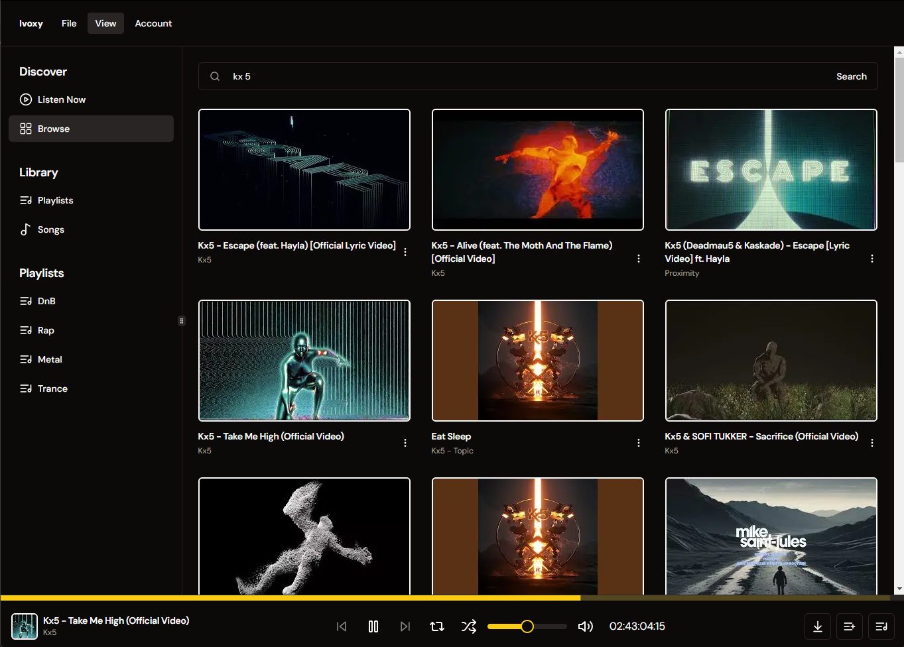

# Ivoxy

Ivoxy is a web application built with Next.js that showcases how to integrate YouTube's API to search for and play music videos. This project is intended for learning purposes to illustrate the use of Next.js and YouTube's API.

## Table of Contents

-   [Introduction](#introduction)
-   [Features](#features)
-   [Technologies Used](#technologies-used)
-   [Known Issues](#known-issues)
-   [License](#license)

## Introduction

This project demonstrates the implementation of a music app using Next.js and YouTube's API. Users can search for music videos and play them directly within the app, save songs and create playlists to organize their music library.
**This project is intended for learning purposes only and should not be used for commercial purposes.**

## Features

-   Search for music videos using YouTube's API
-   Play music videos directly in the app
-   Save songs and create playlists to organize your music library

## Technologies Used

-   [Next.js 15 RC](https://nextjs.org/)
-   [React 19 RC](https://reactjs.org/)
-   [Supabase](https://supabase.com/)
-   [YouTube Data API v3](https://developers.google.com/youtube/v3)
-   [Shadcn/ui](https://ui.shadcn.com/)
-   [React Player](https://www.npmjs.com/package/react-player)
-   [Zustand](https://www.npmjs.com/package/zustand)

## Known Issues

-   Player sometimes doesn't autoplay when it should
-   Progress bar bugs out when duration is too long
-   Saving a song in the mix menu also plays it
-   Title in the mix menu hides button when it's too long

## License

This project is licensed under the MIT License. See the [LICENSE](https://en.wikipedia.org/wiki/MIT_License) for more information.
